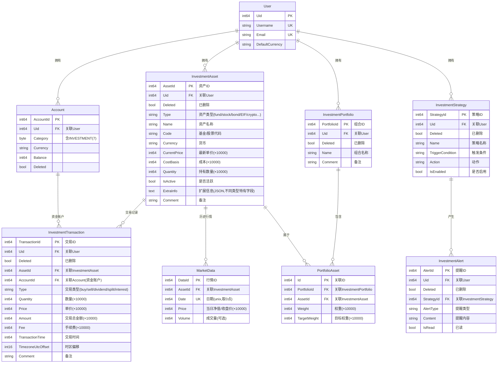
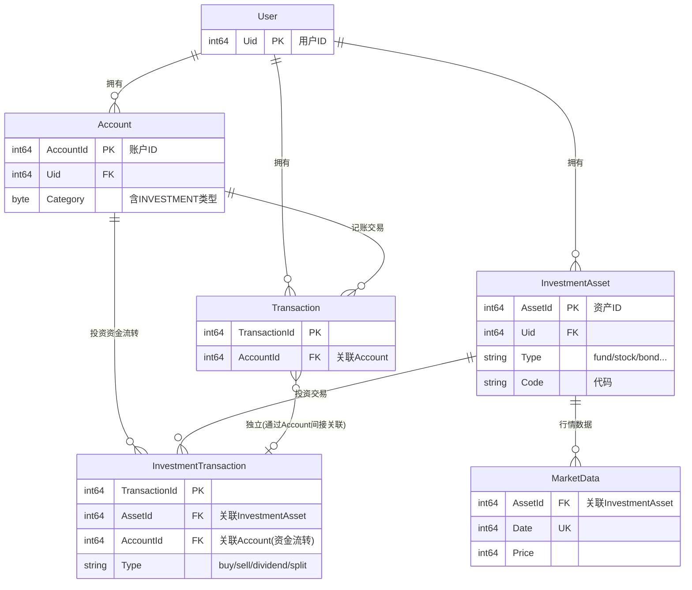

# ezBookkeeping 数据库 ER 图

> 生成日期：2026-05-08
> 包含：现有表 + 新增投资模块表

---

## 一、现有数据库 ER 图（阶段 1 前）

```mermaid
erDiagram
    User {
        int64 Uid PK "用户ID"
        string Username UK "用户名"
        string Email UK "邮箱"
        string Password "密码哈希"
        string Salt "密码盐"
        int64 DefaultAccountId "默认账户"
        byte TransactionEditScope "交易编辑范围"
        string Language "语言"
        string DefaultCurrency "默认货币"
        bool EmailVerified "邮箱已验证"
        bool Disabled "已禁用"
        bool Deleted "已删除"
    }

    TwoFactor {
        int64 Uid PK "关联User"
        string Secret "2FA密钥"
    }

    TwoFactorRecoveryCode {
        int64 Uid PK "关联User"
        string RecoveryCode PK "恢复码"
        bool Used "已使用"
    }

    TokenRecord {
        int64 Uid PK "关联User"
        int64 UserTokenId PK "令牌ID"
        byte TokenType "令牌类型"
        string Secret "密钥"
        string UserAgent "用户代理"
        blob Context "上下文(JSON)"
    }

    UserExternalAuth {
        int64 Uid PK "关联User"
        string ExternalAuthType PK "OAuth类型"
        string ExternalUsername UK "外部用户名"
        string ExternalEmail UK "外部邮箱"
    }

    UserApplicationCloudSetting {
        int64 Uid PK "关联User"
        string SettingKey PK "设置键"
        string SettingValue "设置值"
    }

    UserCustomExchangeRate {
        int64 Uid PK "关联User"
        string Currency PK "货币代码"
        int64 Rate "汇率"
    }

    Account {
        int64 AccountId PK "账户ID"
        int64 Uid FK "关联User"
        byte Category "账户类别(Cash/CreditCard/Investment...)"
        byte Type "账户类型(单账户/多子账户)"
        int64 ParentAccountId "父账户ID(自引用)"
        string Name "账户名"
        string Currency "货币"
        int64 Balance "余额"
        bool Deleted "已删除"
        bool Hidden "已隐藏"
    }

    TransactionCategory {
        int64 CategoryId PK "分类ID"
        int64 Uid FK "关联User"
        bool Deleted "已删除"
        byte Type "收入/支出/转账"
        int64 ParentCategoryId "父分类ID(自引用,二级分类)"
        string Name "分类名"
        int64 Icon "图标"
        string Color "颜色"
        bool Hidden "已隐藏"
    }

    TransactionTagGroup {
        int64 TagGroupId PK "标签组ID"
        int64 Uid FK "关联User"
        bool Deleted "已删除"
        string Name "标签组名"
    }

    TransactionTag {
        int64 TagId PK "标签ID"
        int64 Uid FK "关联User"
        bool Deleted "已删除"
        int64 TagGroupId FK "关联TransactionTagGroup"
        string Name "标签名"
        bool Hidden "已隐藏"
    }

    Transaction {
        int64 TransactionId PK "交易ID"
        int64 Uid FK "关联User"
        bool Deleted "已删除"
        byte Type "交易类型(收入/支出/转账出/转账入/余额调整)"
        int64 CategoryId FK "关联TransactionCategory"
        int64 AccountId FK "关联Account(来源账户)"
        int64 Amount "金额"
        int64 RelatedAccountId "关联账户(转账目标)"
        int64 RelatedAccountAmount "关联账户金额"
        int64 TransactionTime "交易时间"
        string Comment "备注"
        float64 GeoLongitude "经度"
        float64 GeoLatitude "纬度"
        bool HideAmount "隐藏金额"
    }

    TransactionTagIndex {
        int64 TagIndexId PK "索引ID"
        int64 Uid FK "关联User"
        bool Deleted "已删除"
        int64 TagId FK "关联TransactionTag"
        int64 TransactionId FK "关联Transaction"
        int64 TransactionTime "交易时间(冗余,加速查询)"
    }

    TransactionTemplate {
        int64 TemplateId PK "模板ID"
        int64 Uid FK "关联User"
        bool Deleted "已删除"
        byte TemplateType "普通/定时"
        string Name "模板名"
        byte Type "交易类型"
        int64 CategoryId "分类ID"
        int64 AccountId "账户ID"
        int64 Amount "金额"
        int64 RelatedAccountId "关联账户"
        int64 RelatedAccountAmount "关联金额"
        byte ScheduledFrequencyType "定时频率(每周/每月)"
        string ScheduledFrequency "定时频率配置"
        int64 ScheduledStartTime "定时起始时间"
        int64 ScheduledEndTime "定时结束时间"
        int16 ScheduledAt "定时时刻"
        string TagIds "标签ID列表(逗号分隔)"
        bool HideAmount "隐藏金额"
    }

    TransactionPictureInfo {
        int64 PictureId PK "图片ID"
        int64 Uid FK "关联User"
        bool Deleted "已删除"
        int64 TransactionId FK "关联Transaction"
        string PictureExtension "图片扩展名"
    }

    InsightsExplorer {
        int64 ExplorerId PK "探索器ID"
        int64 Uid FK "关联User"
        bool Deleted "已删除"
        string Name "名称"
        blob Data "配置数据(JSON)"
        bool Hidden "已隐藏"
    }

    User ||--o{ TwoFactor : "1对1"
    User ||--o{ TwoFactorRecoveryCode : "拥有"
    User ||--o{ TokenRecord : "拥有"
    User ||--o{ UserExternalAuth : "拥有"
    User ||--o{ UserApplicationCloudSetting : "拥有"
    User ||--o{ UserCustomExchangeRate : "拥有"
    User ||--o{ Account : "拥有"
    User ||--o{ TransactionCategory : "拥有"
    User ||--o{ TransactionTagGroup : "拥有"
    User ||--o{ Transaction : "拥有"
    User ||--o{ TransactionTemplate : "拥有"
    User ||--o{ TransactionPictureInfo : "拥有"
    User ||--o{ InsightsExplorer : "拥有"

    TransactionTagGroup ||--o{ TransactionTag : "包含"
    TransactionTag ||--o{ TransactionTagIndex : "被引用"
    Transaction ||--o{ TransactionTagIndex : "被标记"
    TransactionCategory ||--o{ Transaction : "分类"
    Account ||--o{ Transaction : "关联"

    Account ||--o{ Account : "子账户(ParentAccountId自引用)"
    TransactionCategory ||--o{ TransactionCategory : "子分类(ParentCategoryId自引用)"
```

> **图例**：`UK`=唯一约束，`FK`=外键关联，`自引用`=表内父子关系

---

## 二、新增投资模块 ER 图（阶段 1 完成后）

> **图例**：`×10000` 表示金额/数量/价格均以 10000 倍整数存储，与现有 `Transaction.Amount` 精度一致。

---

## 三、新旧表关系整合

### 关键设计决策

1. **Transaction 和 InvestmentTransaction 完全独立**，不共用表
   - 字段结构完全不同（投资需要数量、单价、手续费、基金代码等）
   - 查询模式不同（投资按产品聚合，记账按分类聚合）
   - 通过 `Account` 表在资金层面间接关联

2. **MarketData 与 InvestmentAsset 关联**
   - 每日 cron 拉取行情 → 写入 market_data
   - API 失效后历史数据仍在本地，不影响计算和图表

3. **复用现有基础设施**
   - User 认证 → JWT 中间件
   - Account 体系 → 复用投资账户概念
   - 货币/汇率 → 复用现有 exchange_rates 模块
   - 时区 → 复用现有时区处理